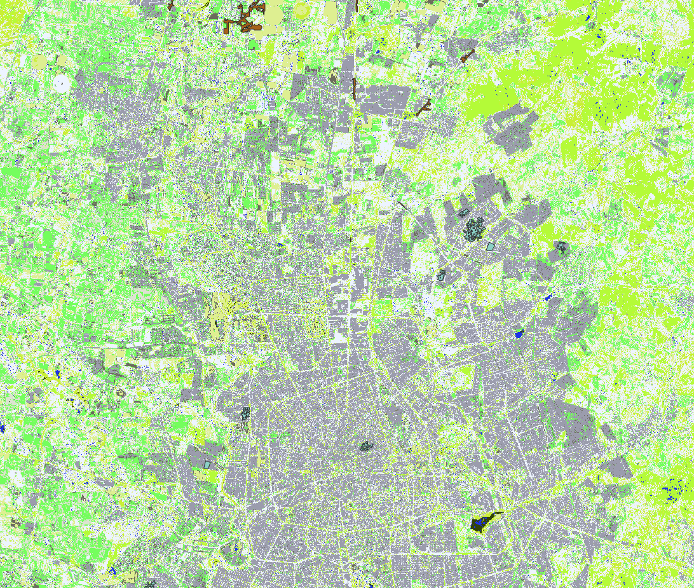

<p align="center">
  
</p>

<h1 align="center">DeCreML – Detección de Crecimientos con Machine Learning (OTB)</h1>

<p align="center">
  <b>Versión:</b> 1.2.0 · 
  <b>Compatible con QGIS:</b> 3.22 – 3.99 · 
  <b>Autor:</b> RUIZ GONZALEZ JUAN CARLOS
</p>

---

## 🛰️ ¿Qué es DeCreML?

**DeCreML** es un complemento avanzado para QGIS que implementa un flujo completo de  
**clasificación supervisada de imágenes multiespectrales** mediante  
**Machine Learning (Random Forest)** utilizando el framework **Orfeo ToolBox (OTB)**.

El complemento permite analizar crecimiento urbano, uso de suelo y cambios espaciales a partir de imágenes satelitales como **Sentinel-2**, ortofotos o cualquier ráster multiespectral.

---

## ✅ Funcionalidades principales

- ✅ Cálculo automático de estadísticas de imagen (OTB)
- ✅ Entrenamiento de modelos Random Forest con muestras vectoriales
- ✅ Clasificación ráster multiespectral
- ✅ Aplicación automática de estilo QML según clases definidas
- ✅ Ejecución desde la barra de herramientas con un solo clic
- ✅ Integración completa con QGIS Processing
- ✅ Resultados listos para posterior análisis y vectorización

---

## 🧠 Requisitos

Para utilizar DeCreML necesitas:

| Recurso | Detalle |
|--------|---------|
| **QGIS** | Versiones 3.22 hasta 3.99 |
| **OTB (Orfeo ToolBox)** | Configurado correctamente en QGIS |
| **Capa de entrenamiento** | Polígonos con un campo de clases (ej. `LABEL`) |
| **Imagen multiespectral** | Sentinel-2, ortofoto o similar |

---

## ⚙️ Instalación

### ✅ Método recomendado: Carpeta del repositorio

1. Descarga o clona el repositorio:

```bash
git clone https://github.com/enrique1497m-dot/qgis-plugins
